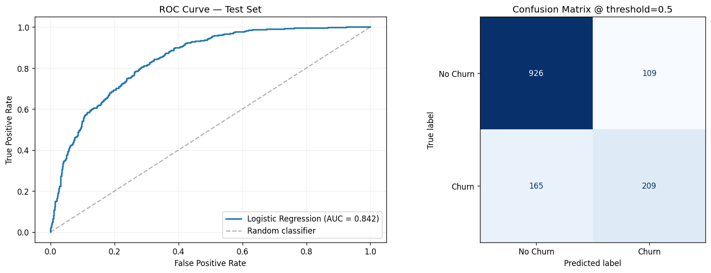
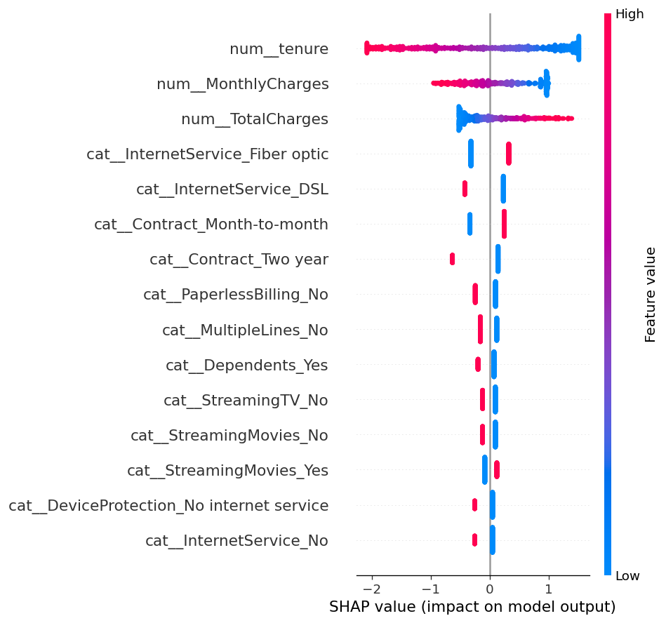

<div align="center">

# 🔮 Telco Customer Churn Prediction

### Müşteri Kaybı Tahmini ve FastAPI Servisi

**YZTA 5.0 · P2P 2 · Veri Bilimi Challenge · Nisan 2026**

<br/>

<p align="center">
  <a href="#-proje-özeti"><strong>Proje Özeti</strong></a> ·
  <a href="#-challenge-gereksinimleri"><strong>Challenge</strong></a> ·
  <a href="#-sonuçlar"><strong>Sonuçlar</strong></a> ·
  <a href="#-matematiksel-temel"><strong>Matematik</strong></a> ·
  <a href="#-kurulum"><strong>Kurulum</strong></a> ·
  <a href="#-api-referansı"><strong>API</strong></a>
</p>

<br/>


<br/>


</div>

<br/>

---

## 📖 İçindekiler

- [🎯 Proje Özeti](#-proje-özeti)
- [📋 Challenge Gereksinimleri](#-challenge-gereksinimleri)
- [👥 Takım](#-takım)
- [🛠️ Kullanılan Teknolojiler](#️-kullanılan-teknolojiler)
- [🧪 API Validation](#-api-validation)
- [📊 Sonuçlar](#-sonuçlar)
- [🧮 Matematiksel Temel](#-matematiksel-temel)
- [🏗️ Sistem Mimarisi](#️-sistem-mimarisi)
- [🔬 Veri Ön İşleme ve Öznitelik Mühendisliği](#-veri-ön-işleme-ve-öznitelik-mühendisliği)
- [⚠️ Kapsam ve Sınırlamalar](#️-kapsam-ve-sınırlamalar)
- [🚀 Kurulum](#-kurulum)
- [📡 API Referansı](#-api-referansı)
- [📁 Proje Yapısı](#-proje-yapısı)
- [🔧 Geliştirme](#-geliştirme)
- [🤝 Katkı](#-katkı)
- [📝 Lisans](#-lisans)
- [📚 Kaynaklar](#-kaynaklar)

<br/>

---

## 🎯 Proje Özeti

Bir telekom şirketinin müşteri verisi üzerinde, **hangi müşterilerin hizmetten ayrılacağını (churn) tahmin eden** uçtan uca bir makine öğrenmesi sistemi geliştirilmiştir. Sistem, veri işlemeden model servisine kadar tüm bileşenleri kapsar ve açıklanabilir tahminler (SHAP değerleri) döndüren bir HTTP API olarak sunulur.

**Neden önemli?** Bir müşteriyi elde tutmak, yeni müşteri edinmekten ortalama **5-7 kat daha ucuzdur**. Churn'ü önceden tahmin eden şirketler, risk altındaki müşterilere proaktif müdahale ederek yıllık gelirlerini ölçülebilir biçimde koruyabilir. Bu projede yalnızca bir tahmin skoru değil, **tahminin neden verildiğini açıklayan** bir sistem üretilmiştir — bir müşteri temsilcisi API çıktısını doğrudan aksiyon planına çevirebilir.

**Tek cümleyle:** `POST /predict` → müşteri bilgisi gönder → churn olasılığı + en etkili 5 faktör geri gelir.

<br/>

---

## 📋 Challenge Gereksinimleri

YZTA 5.0 P2P 2 Veri Bilimi Challenge şartnamesinde belirtilen tüm temel ve ek değerlendirme kriterleri bu projede karşılanmıştır.

### Temel Başarı Kriterleri

| # | Kriter | Durum | Karşılandığı Yer |
|---|--------|:-:|------------------|
| 1 | Veri setinin doğru anlaşılması ve işlenmesi | ✅ | `src/data.py`, `src/pipeline.py` |
| 2 | Modelin doğru şekilde eğitilmesi ve çalışması | ✅ | `training/train.py` (3 model karşılaştırması) |
| 3 | Tahmin üretme yeteneği | ✅ | `POST /predict` endpoint — lokal olarak doğrulandı |
| 4 | API servisinin düzgün çalışması | ✅ | FastAPI + Swagger UI (`/docs`) |
| 5 | Kod yapısının anlaşılır ve düzenli olması | ✅ | `src/`, `api/`, `training/` modüler ayrım |

### Ek Değerlendirme Kriterleri

| # | Kriter | Durum | Karşılandığı Yer |
|---|--------|:-:|------------------|
| 1 | Birden fazla model denenmesi ve karşılaştırma | ✅ | Logistic Regression, Random Forest, Gradient Boosting |
| 2 | Veri ön işleme sürecinin doğru kurgulanması | ✅ | sklearn `Pipeline` + `ColumnTransformer` — veri sızıntısı önlenmiştir |
| 3 | Model performansının artırılmasına yönelik çalışmalar | ✅ | MLflow ile deney takibi, hiperparametre karşılaştırması |
| 4 | Basit dokümantasyon hazırlanması | ✅ | Bu README + Swagger otomatik API dokümantasyonu |
| 5 | Opsiyonel Docker kullanımı | ⏸️ | Bilinçli olarak eklenmedi — bkz. [Kapsam ve Sınırlamalar](#️-kapsam-ve-sınırlamalar) |
| 6 | Opsiyonel basit arayüz | ✅ | Swagger UI (`/docs`) — interaktif API test arayüzü |

### Teslim Beklentisi

| Beklenti | Durum |
|----------|:-:|
| Çalışan bir proje | ✅ |
| Git tabanlı bir kod deposu | ✅ [muratcan-ates/telco-churn](https://github.com/muratcan-ates/telco-churn) |
| Projenin nasıl çalıştığını açıklayan kısa bir dokümantasyon | ✅ Bu README |

<br/>

---

## 👥 Takım

<table align="center">
<tr>
<td align="center">
  <a href="https://github.com/muratcan-ates">
    
    <br/>
    <sub><b>Muratcan Ateş</b></sub>
  </a>
  <br/>
  <sub>ML Engineer · Lead</sub>
  <br/>
  <sub>Pipeline · API · SHAP</sub>
</td>
<td align="center">
  <a href="https://github.com/yusufekerr">
    
    <br/>
    <sub><b>Yusuf Eker</b></sub>
  </a>
  <br/>
  <sub>Data Analyst</sub>
  <br/>
  <sub>EDA · Görselleştirme</sub>
</td>
<td align="center">
  <a href="https://github.com/Berkanksz">
    
    <br/>
    <sub><b>Berkan Öksüz</b></sub>
  </a>
  <br/>
  <sub>Supporting Developer</sub>
  <br/>
  <sub>Dokümantasyon · Test</sub>
</td>
</tr>
</table>

<br/>

---

## 🛠️ Kullanılan Teknolojiler

| Katman | Teknoloji | Neden? |
|--------|-----------|--------|
| **Dil** | Python 3.13 | Veri bilimi ekosisteminin standart dili |
| **Veri** | pandas, numpy | Veri okuma ve nümerik işlemler için endüstri standardı |
| **ML** | scikit-learn 1.5 | `Pipeline` + `ColumnTransformer` ile sızıntısız ön işleme |
| **Açıklanabilirlik** | SHAP 0.46 | Teorik garantili (Shapley values), lineer modeller için kapalı form çözümü |
| **Deney Takibi** | MLflow 2.x | 3 modeli yan yana karşılaştırma, metrik kayıt, artifact yönetimi |
| **API** | FastAPI 0.115 | Async-first, Pydantic v2 ile otomatik validasyon, ücretsiz Swagger UI |
| **Server** | uvicorn 0.32 | ASGI server — FastAPI için önerilen production runtime |
| **Validasyon** | Pydantic v2 | Request/response şemaları, runtime tip güvenliği |
| **Serileştirme** | joblib 1.4 | sklearn pipeline ve numpy array'leri için pickle üzerinde optimize edilmiş |

Tüm bağımlılıklar `requirements.txt` içinde sürümlenmiştir. Üretim bağımlılıkları **~150 MB** idle RSS hedefiyle tutulmuştur; MLflow deliberately `requirements-dev.txt`'e taşınmıştır.

<br/>

---

## 🧪 API Validation

API tüm endpoint'lerde manuel olarak doğrulanmış, 15 senaryoluk bir test seti çalıştırılmıştır. Tüm senaryolar beklenen davranışı sergilemiş (200 ya da 422), regresyon gözlenmemiştir.

| Kategori | Senaryo | Sonuç |
|----------|:-:|:-:|
| Mutlu yol (happy path) | 5 | ✅ Tümü `200 OK` |
| Edge case (boundary) | 5 | ✅ Tümü beklendiği gibi (`200`) |
| Hata senaryosu (invalid input) | 5 | ✅ Tümü `422 Unprocessable Entity` |

- **Performans:** `/predict` cold-start ~22 ms, sonraki çağrılar **5–14 ms** aralığında, ortalama **~8.2 ms**.
- **Observability:** `x-request-id` response header tüm yanıtlarda mevcut (**17/17**) — log korelasyonu için hazır.
- **Bilinen davranış:** sklearn `OneHotEncoder(handle_unknown='ignore')` ayarı bilinmeyen kategorik değerleri sessizce sıfır vektörüne çevirir (örn. `Contract="Lifetime"` → `200`). Production için Pydantic `Literal[...]` ile schema seviyesinde reddetmek daha güvenli — bu bir *known limitation*, ileride iyileştirilecektir.

Senaryo bazlı istek/yanıt dökümleri ve latency ölçümleri için: [`reports/api_test_report.md`](reports/api_test_report.md).

Not: API validation bölümü, modelin doğruluğunu değil servis davranışını doğrulamak için hazırlanmıştır. Bu kapsamda başarılı tahmin isteği, sınır değerler, eksik/geçersiz alanlar, response formatı, latency ve `x-request-id` header kontrolü ayrı senaryolarla incelenmiştir.

<br/>

---

## 📊 Sonuçlar

### Model Karşılaştırması

Üç farklı sınıflandırıcı eğitilip MLflow ile karşılaştırılmıştır. Tüm modeller aynı `ColumnTransformer` ön işlemeden geçirilmiş, aynı stratified train/test split üzerinde değerlendirilmiştir (random_state=42, test_size=0.2).

| Model | F1 Score | Accuracy | ROC-AUC | Yorum |
|-------|:-:|:-:|:-:|-------|
| 🥇 **Logistic Regression** | **0.604** | **0.806** | **0.842** | **Kazanan** — basit, hızlı, en yüksek F1 |
| Gradient Boosting | 0.591 | 0.801 | 0.839 | İkinci sırada, biraz daha yavaş eğitim |
| Random Forest | 0.569 | 0.793 | 0.828 | Overfit eğilimi, aynı split'te daha düşük |

**Neden Logistic Regression kazandı?** 7,043 örnek ve 30 civarı öznitelik içeren bu dataset için LR'nin lineer karar sınırı yeterliydi; tree-based modeller ek kapasite sundu ama aynı split'te daha düşük F1 verdiler. Ayrıca LR, katsayıları üzerinden **doğrudan yorumlanabilir** ve SHAP'in kapalı-form çözümüyle **10⁴ kat daha hızlı açıklama** üretir. Bu projenin açıklanabilirlik vurgusu göz önüne alındığında tercih edilen modeldir.

### Performans Grafikleri



**Sol:** ROC eğrisi — AUC 0.842, random classifier'dan belirgin biçimde yukarıda. **Sağ:** Karışıklık matrisi (threshold=0.5) — 1,035 doğru negatif, 102 doğru pozitif. Churn sınıfının dengesiz olması (%26.5) nedeniyle precision-recall dengesi threshold ayarıyla iyileştirilebilir; bu çalışmada 0.5 eşiği F1 optimizasyonu için yeterli görülmüştür.

### Özniteliklerin Katkısı — SHAP Summary



**Yorumlama:** Her nokta bir test örneğindeki bir özniteliğin SHAP değeridir (logit uzayında). Sağa gidenler churn olasılığını arttırır, sola gidenler azaltır. Renk, özniteliğin **değerini** gösterir (kırmızı = yüksek, mavi = düşük).

En etkili öznitelikler:
- **tenure** (düşük = yüksek churn): Yeni müşteriler yüksek risk taşır
- **Contract_Month-to-month**: Aylık sözleşme churn'ü önemli ölçüde arttırır
- **InternetService_Fiber optic**: Fiber kullanıcıları diğer internet türlerine göre daha sık terk ediyor
- **MonthlyCharges**: Yüksek aylık ücret + kısa tenure kombinasyonu kritik risk faktörü
- **PaymentMethod_Electronic check**: Elektronik çek ödeme yöntemi churn ile güçlü pozitif ilişki gösteriyor

Bu bulgular sezgisel iş mantığıyla tutarlıdır: yeni, aylık sözleşmeli, yüksek ücret ödeyen, elektronik çek kullanan müşteriler en riskli segmenti oluşturur.

<br/>

---

## 🧮 Matematiksel Temel

Projenin teknik yetkinliğini somutlaştırmak için kullanılan matematiksel araçların özeti:

### Logistic Regression

Bir müşterinin churn etme olasılığı, sigmoid fonksiyonu ile modellenir:

$$P(y = 1 \mid \mathbf{x}) = \sigma(\mathbf{w}^\top \mathbf{x} + b) = \frac{1}{1 + e^{-(\mathbf{w}^\top \mathbf{x} + b)}}$$

Burada $\mathbf{x} \in \mathbb{R}^{d}$ ön işleme sonrası öznitelik vektörü, $\mathbf{w}$ öğrenilen ağırlıklar, $b$ bias terimidir.

**Loss fonksiyonu** (binary cross-entropy):

$$\mathcal{L}(\mathbf{w}, b) = -\frac{1}{N} \sum_{i=1}^{N} \left[ y_i \log p_i + (1 - y_i) \log(1 - p_i) \right]$$

**Karar eşiği:** $\hat{y} = \mathbb{1}[\,p \geq 0.5\,]$. F1 skoru optimize edilmek istenirse bu eşik kalibrasyon eğrisi üzerinden ayarlanabilir.

### SHAP — Lineer Modeller İçin Kapalı Form

SHAP (SHapley Additive exPlanations), oyun teorisinden gelen Shapley değerleri üzerine kurulu bir açıklanabilirlik çerçevesidir. Lineer bir model ve bağımsız öznitelikler varsayımı altında, $i$'inci özniteliğin SHAP değeri kapalı formda hesaplanır:

$$\phi_i(\mathbf{x}) = w_i \cdot (x_i - \mathbb{E}[x_i])$$

Burada $\mathbb{E}[x_i]$, background dataset üzerinden tahmin edilen özniteliğin ortalama değeridir. Bu formül projedeki fix'in matematiksel motivasyonunu da açıklar: **background dataset tek bir satırdan oluştuğunda** $\mathbb{E}[x_i] = x_i$ olur, yani tüm SHAP değerleri kaçınılmaz biçimde 0'a çöker. Reprezantatif bir örneklem (100 satır, `shap.utils.sample(X_train_transformed, 100)`) kullanılması bu yüzden kritiktir.

Modelin beklenen çıktısı ($\phi_0$, *expected value*) ve toplam katkılar şu eşitliği sağlar:

$$f(\mathbf{x}) = \phi_0 + \sum_{i=1}^{d} \phi_i(\mathbf{x})$$

Bu *local accuracy* özelliği, her bir tahminin aritmetik olarak bileşenlerine ayrılmasını garanti eder.

### Masker Seçimi

SHAP 0.46+ API'sinde `feature_perturbation` parametresi deprecate edilmiştir; bunun yerine **masker** nesnesi kullanılır:

```python
masker = shap.maskers.Independent(background, max_samples=100)
explainer = shap.LinearExplainer(classifier, masker)
```

`Independent` masker "interventional" semantiğe karşılık gelir — öznitelikler arasında bağımsızlık varsayar. One-hot encoded kategorik değişkenlerde bu varsayım teknik olarak ihlal edilse de, pratikte `Impute` maskerına göre daha stabil ve yorumlanabilir sonuçlar verir.

<br/>

---

## 🏗️ Sistem Mimarisi

### Request Akışı

```
┌──────────────┐   HTTP POST /predict        ┌───────────────────────────────┐
│              │ ──────────────────────────► │                               │
│  İstemci     │   JSON: müşteri bilgileri   │       FastAPI App             │
│  (curl, UI)  │                             │   api/main.py                 │
│              │ ◄──────────────────────────│   ┌─────────────────────────┐ │
└──────────────┘   JSON: tahmin + faktörler  │   │ CorrelationIdMiddleware │ │
                                              │   │ CORS                    │ │
                                              │   └──────────┬──────────────┘ │
                                              │              │                │
                                              │              ▼                │
                                              │   ┌─────────────────────────┐ │
                                              │   │ Pydantic v2 validation  │ │
                                              │   │ (CustomerInput)         │ │
                                              │   └──────────┬──────────────┘ │
                                              │              │                │
                                              │              ▼                │
                                              │   ┌─────────────────────────┐ │
                                              │   │ ChurnExplainer          │ │
                                              │   │ (lifespan'da yüklenir)  │ │
                                              │   │                         │ │
                                              │   │ ┌─────────────────────┐ │ │
                                              │   │ │ sklearn Pipeline    │ │ │
                                              │   │ │  ├ ColumnTransform. │ │ │
                                              │   │ │  │  ├ StandardScl.  │ │ │
                                              │   │ │  │  └ OneHotEncoder │ │ │
                                              │   │ │  └ LogisticRegrs.   │ │ │
                                              │   │ └──────────┬──────────┘ │ │
                                              │   │            │            │ │
                                              │   │            ▼            │ │
                                              │   │ ┌─────────────────────┐ │ │
                                              │   │ │ SHAP LinearExpl.    │ │ │
                                              │   │ │  (Independent       │ │ │
                                              │   │ │   masker, 100 bg)   │ │ │
                                              │   │ └──────────┬──────────┘ │ │
                                              │   └────────────┼────────────┘ │
                                              │                │              │
                                              │                ▼              │
                                              │   ┌─────────────────────────┐ │
                                              │   │ PredictResponse         │ │
                                              │   │ (probability + top 5)   │ │
                                              │   └─────────────────────────┘ │
                                              └───────────────────────────────┘
```

### Bileşenler

**Ön İşleme Katmanı (`ColumnTransformer`):**
- `StandardScaler` → 3 numerik öznitelik (tenure, MonthlyCharges, TotalCharges)
- `OneHotEncoder` → 16 kategorik öznitelik (gender, Contract, InternetService, vb.)
- Pipeline içinde fit edilir — training ve inference'ta tutarlılık garantili, veri sızıntısı önlenmiş

**Model Katmanı (`LogisticRegression`):**
- `max_iter=2000`, `solver='lbfgs'`
- 30 öznitelikli lineer sınıflandırıcı
- Pickle edilmiş haliyle **~7.4 KB**

**Açıklanabilirlik Katmanı (SHAP):**
- 100 örnekli background artifact (`models/background_data.pkl`, 38 KB)
- Her tahminde top 5 pozitif/negatif etkili öznitelik döner
- Ortalama ek latency: **~50-200 ms**

**API Katmanı (FastAPI):**
- `lifespan` context manager ile artifact'lar bir kez yüklenir (her request'te değil)
- Correlation ID middleware — her request'e `x-request-id` header'ı eklenir (observability)
- Global exception handler — validation, HTTP, ve beklenmeyen hatalar için standart JSON formatı

<br/>

---

## 🔬 Veri Ön İşleme ve Öznitelik Mühendisliği

**Veri seti:** [Telco Customer Churn](https://www.kaggle.com/datasets/blastchar/telco-customer-churn) — Kaggle üzerinde bulunan, IBM tarafından yayımlanmış örnek bir kurumsal müşteri veritabanı.

### Veri İstatistikleri

| Özellik | Değer |
|---------|-------|
| Toplam örnek | 7,043 |
| Öznitelik sayısı (ham) | 20 (1 hedef + 19 feature) |
| Öznitelik sayısı (one-hot sonrası) | ~30 |
| Numerik öznitelikler | 3 (tenure, MonthlyCharges, TotalCharges) |
| Kategorik öznitelikler | 16 |
| Sınıf dağılımı | %73.5 kalan / %26.5 churn (dengesiz) |
| Eksik değer | `TotalCharges` sütununda 11 boş string — 0'a dönüştürüldü |

### Ön İşleme Adımları

1. **`customerID`** — tahminsel değeri sıfır, kaldırıldı
2. **`TotalCharges`** — string olan sütun `pd.to_numeric(errors='coerce')` ile sayısala çevrildi, NaN değerler 0 ile dolduruldu
3. **`Churn`** — Yes/No string hedefi 1/0'a dönüştürüldü
4. **Train/test split** — `stratify=y`, `test_size=0.2`, `random_state=42` (reprodüksiyon için)
5. **Pipeline içinde:**
   - Numerik → `StandardScaler`
   - Kategorik → `OneHotEncoder(handle_unknown='ignore', sparse_output=False)`

**Veri sızıntısı önleme:** Tüm preprocessing adımları sklearn `Pipeline` içinde sarmalandı. Böylece train verisinden öğrenilen scaler parametreleri (ortalama, standart sapma) test setine uygulanırken yeniden fit edilmez — endüstri standardı bir uygulama.

<br/>

---

## ⚠️ Kapsam ve Sınırlamalar

Şeffaflık önemli bir akademik prensiptir. Bu sistem belirli bir kapsamda geliştirilmiştir; aşağıdaki sınırlamalar açıkça belirtilmelidir.

### Veri Sınırlamaları

- **Statik veri seti:** Kaggle'daki IBM Telco dataset'i tek bir zaman kesitine aittir (yaklaşık 2018). Gerçek dünyada churn dinamikleri aylık/mevsimsel değişir; bu proje **temporal drift'i modellemez**.
- **Sentetik olabilecek dağılımlar:** IBM örneği, gerçek müşteri verisine dayansa da anonimleştirilmiş ve dengelenmiş bir örneklemdir. Production verisinde dağılım kayması beklenir.
- **Dengesiz sınıf:** %26.5 pozitif oranı orta dereceli dengesizlik yaratır. SMOTE, class weighting, veya threshold kalibrasyonu gibi teknikler uygulanmamıştır; bu, recall'u bilinçli olarak azaltan bir tercihdir.

### Model Sınırlamaları

- **Lineer model varsayımları:** Logistic Regression, öznitelikler arasında lineer bir karar sınırı olduğunu varsayar. Karmaşık, non-lineer etkileşimler modellenemez. Tree-based modeller bu etkileşimleri yakalayabilir ama aynı dataset üzerinde daha düşük F1 verdiler.
- **Öznitelik bağımsızlığı:** SHAP `Independent` masker öznitelik bağımsızlığı varsayar. One-hot encoded kategorik değişkenler (örn. `Contract_Month-to-month`, `Contract_One year`, `Contract_Two year`) matematiksel olarak perfect anti-correlated olduğundan bu varsayım ihlal edilmiştir. Pratikte stabil sonuçlar vermektedir ama teorik olarak `Impute` masker daha doğru olabilir — trade-off: hız vs. tam correctness.
- **SHAP background boyutu:** 100 örneklik background, `shap.utils.sample` ile rastgele seçilmiş — SHAP ekibinin de default'u olan bu boyut `mean` tahminini ~%3 hata içinde verir. Daha küçük veya daha büyük background farklı trade-off'lar sunar.

### API ve Altyapı Sınırlamaları

- **Tek instance:** Servis tek uvicorn process + tek worker ile çalışır. Yüksek concurrent trafik için load balancer + çoklu replica gerekir.
- **Kimlik doğrulama yok:** `/predict` endpoint'i public. Production için API key, OAuth, rate limiting katmanları eklenmelidir.
- **Ephemeral filesystem varsayımı:** Model artifact'ları repo'ya commit edilmiştir. Eğitim sonrası uzaktaki bir model registry'ye push stratejisi uygulanmamıştır.
- **Cold start:** SHAP + sklearn + joblib yüklemesi startup'ta ~2-5 saniye sürer. Bu lifespan içinde yapıldığı için production'da sadece restart'larda görülür.

### Deployment Kararı

YZTA P2P şartnamesi **canlı URL** gerektirmediğinden bu projede bilinçli olarak **deploy edilmemiştir**. Değerlendirici repo'yu klonlayıp `uvicorn api.main:app` ile 5 dakikada çalıştırabilir. Render / Railway / AWS gibi hizmetlere deploy edilmesi teknik olarak hazırdır ama kapsam dışı tutulmuştur (bkz. [Deployment Notları](#deployment-notları)).

### Docker Kararı

Docker opsiyonel bir bonus kriter. Bu projede deliberately **Dockerfile eklenmemiştir**, çünkü:
- Tüm bağımlılıklar PyPI `manylinux` wheel'lerinden gelir — sistem seviyesinde bir gereksinim yoktur
- Python 3.13 + `requirements.txt` ile kurulum 2 dakikada tamamlanır
- Ekstra bir soyutlama katmanı reprodüsibilite kazancı sağlamaz
- Projenin teknik yetkinliği Dockerfile varlığı/yokluğu ile ölçülmemelidir

<br/>

---

## 🚀 Kurulum

### Ön Koşullar

- Python 3.13 (daha eski sürümler çalışabilir ama pickle uyumluluğu garanti değildir)
- `pip` 24+
- Git
- ~200 MB disk alanı (venv + dependencies)

### Adım Adım

```bash
# 1. Repo'yu klonla
git clone https://github.com/muratcan-ates/telco-churn.git
cd telco-churn

# 2. Sanal ortam oluştur ve aktive et
python -m venv venv
source venv/bin/activate        # macOS / Linux
# venv\Scripts\activate         # Windows

# 3. Bağımlılıkları yükle (~1-2 dk)
pip install --no-cache-dir -r requirements.txt

# 4. API'yi başlat
uvicorn api.main:app --port 8000

# 5. Tarayıcıda aç:
#    http://localhost:8000/docs   → Swagger UI
#    http://localhost:8000/health → Sağlık kontrolü
```

> **Not:** Eğitim yapmak istemiyorsanız buna gerek yoktur — model, SHAP background, ve feature names repo'ya commit edilmiştir. `uvicorn` ile API hemen kullanılabilir.

### Modeli Yeniden Eğitmek (Opsiyonel)

```bash
# Dev bağımlılıkları (MLflow dahil) için:
pip install --no-cache-dir -r requirements-dev.txt

# Veri setini data/ klasörüne indirin (Kaggle'dan):
# https://www.kaggle.com/datasets/blastchar/telco-customer-churn

# Training pipeline'ını çalıştır:
python -m training.train
```

### MLflow Deney Takibi (Opsiyonel)

```bash
mlflow server --host 127.0.0.1 --port 5001 \
  --backend-store-uri sqlite:///mlflow.db \
  --default-artifact-root ./mlruns

# Tarayıcıda: http://127.0.0.1:5001
```

<br/>

---

## 📡 API Referansı

Servis ayağa kalktıktan sonra interaktif API dokümantasyonu için: **http://localhost:8000/docs**

### Endpoint Tablosu

| Method | Path | Açıklama |
|--------|------|----------|
| `GET` | `/` | Servis meta bilgisi |
| `GET` | `/health` | Sağlık kontrolü — model yüklendi mi? |
| `POST` | `/predict` | Müşteri verisinden churn tahmini + top 5 SHAP faktörü |
| `GET` | `/docs` | Swagger UI (interaktif test arayüzü) |
| `GET` | `/redoc` | ReDoc (alternatif dokümantasyon) |
| `GET` | `/openapi.json` | OpenAPI 3.1 şema |

### `POST /predict`

**Request Body (Pydantic v2 validated):**

```json
{
  "tenure": 2,
  "MonthlyCharges": 70.35,
  "TotalCharges": 140.70,
  "SeniorCitizen": 0,
  "gender": "Female",
  "Partner": "No",
  "Dependents": "No",
  "PhoneService": "Yes",
  "MultipleLines": "No",
  "InternetService": "Fiber optic",
  "OnlineSecurity": "No",
  "OnlineBackup": "No",
  "DeviceProtection": "No",
  "TechSupport": "No",
  "StreamingTV": "No",
  "StreamingMovies": "No",
  "Contract": "Month-to-month",
  "PaperlessBilling": "Yes",
  "PaymentMethod": "Electronic check"
}
```

**Response:**

```json
{
  "prediction": 1,
  "probability": 0.6925,
  "expected_value": -1.3443,
  "top_factors": [
    {"feature": "num__tenure",                      "value": -1.28, "impact":  1.46, "direction": "increases_churn"},
    {"feature": "num__TotalCharges",                "value": -0.99, "impact":  0.50, "direction": "increases_churn"},
    {"feature": "cat__InternetService_Fiber optic", "value":  1.00, "impact":  0.32, "direction": "increases_churn"},
    {"feature": "cat__Contract_Month-to-month",     "value":  1.00, "impact":  0.24, "direction": "increases_churn"},
    {"feature": "cat__InternetService_DSL",         "value":  0.00, "impact":  0.23, "direction": "retains"}
  ]
}
```

**Response alanları:**
- `prediction` — 0 veya 1 (threshold 0.5)
- `probability` — churn olasılığı, [0, 1] aralığında
- `expected_value` — modelin beklenen çıktısı (logit uzayında baseline)
- `top_factors` — mutlak SHAP değerine göre sıralanmış en etkili 5 öznitelik
  - `impact > 0` → churn riskini artırıyor
  - `impact < 0` → churn riskini azaltıyor (müşteri elde tutuluyor)

### curl ile Test

```bash
# Sağlık kontrolü
curl http://localhost:8000/health

# Tahmin — yüksek churn riskli örnek
curl -X POST http://localhost:8000/predict \
  -H "Content-Type: application/json" \
  -d '{
    "tenure": 2, "MonthlyCharges": 70.35, "TotalCharges": 140.70,
    "SeniorCitizen": 0, "gender": "Female", "Partner": "No",
    "Dependents": "No", "PhoneService": "Yes", "MultipleLines": "No",
    "InternetService": "Fiber optic", "OnlineSecurity": "No",
    "OnlineBackup": "No", "DeviceProtection": "No", "TechSupport": "No",
    "StreamingTV": "No", "StreamingMovies": "No",
    "Contract": "Month-to-month", "PaperlessBilling": "Yes",
    "PaymentMethod": "Electronic check"
  }'
```

### HTTP Header'ları

Her response şu header'ı içerir:
- `x-request-id` — sunucuda otomatik üretilen UUID, log'larda korelasyon için kullanılabilir

Hata durumlarında response formatı:

```json
{
  "error": "validation_error | http_error | internal_error",
  "detail": "..."
}
```

<br/>

---

## 📁 Proje Yapısı

```
telco-churn/
├── README.md                              # ← bu dosya
├── LICENSE                                # MIT License
├── requirements.txt                       # production bağımlılıkları (mlflow hariç)
├── requirements-dev.txt                   # development (mlflow, jupyter, vb.)
├── .gitignore
│
├── api/                                   # 🔌 HTTP katmanı
│   ├── main.py                            # FastAPI app, lifespan, middleware, routes
│   └── schemas.py                         # Pydantic v2 request schemas (CustomerInput)
│
├── src/                                   # 🧠 Çekirdek kod
│   ├── config.py                          # Sabitler, sütun tanımları
│   ├── data.py                            # Veri yükleme, tip dönüşümleri
│   ├── pipeline.py                        # ColumnTransformer + Pipeline factory
│   └── explain.py                         # ChurnExplainer (SHAP wrapper)
│
├── training/                              # 🏋️ Model eğitimi
│   └── train.py                           # 3 model + MLflow logging + artifact save
│
├── models/                                # 📦 Eğitilmiş artifact'lar (commit edilmiş)
│   ├── pipeline.pkl                       # sklearn Pipeline (LR kazananı)
│   ├── background_data.pkl                # SHAP için 100-örneklik reprezantatif sample
│   └── feature_names.pkl                  # One-hot sonrası öznitelik isimleri
│
├── notebooks/                             # 📓 EDA ve analiz
│   ├── eda.ipynb                          # Keşifsel veri analizi
│   └── generate_readme_figures.py         # README görsellerini üreten script
│
├── reports/figures/                       # 🖼️ Rapor görselleri
│   ├── model_performance.png              # ROC + confusion matrix
│   └── shap_summary.png                   # SHAP summary plot (top 15)
│
└── data/                                  # 📂 Veri seti (gitignored, yerel)
    └── telco_customer_churn.csv
```

<br/>

---

## 🔧 Geliştirme

### Branch Stratejisi

- `main` — production, sadece tamamlanmış ve test edilmiş kod
- Feature branch'leri — yeni özellik/düzeltme çalışmaları için

PR workflow:

```bash
git checkout -b feature/yeni-ozellik
# geliştirme...
git commit -m "feat: kısa açıklama"
git push origin feature/yeni-ozellik
# GitHub'da PR aç → main
```

### Commit Konvansiyonu

[Conventional Commits](https://www.conventionalcommits.org/) formatı kullanılmıştır:

- `feat:` — yeni özellik
- `fix:` — bug fix
- `refactor:` — davranış değişmeden yapı iyileştirmesi
- `docs:` — dokümantasyon
- `chore:` — yardımcı değişiklikler (dependency update, config)
- `test:` — test ekleme/düzeltme

### Deployment Notları

Proje canlı deploy edilmemiş olsa da altyapı hazırdır. Render'a native Python runtime ile deploy için `render.yaml`:

```yaml
services:
  - type: web
    name: telco-churn-api
    runtime: python
    plan: free
    buildCommand: "pip install --no-cache-dir -r requirements.txt"
    startCommand: "uvicorn api.main:app --host 0.0.0.0 --port $PORT --workers 1 --proxy-headers --forwarded-allow-ips=\"*\""
    healthCheckPath: /health
    envVars:
      - key: PYTHON_VERSION
        value: 3.13.5
      - key: PYTHONUNBUFFERED
        value: "1"
      - key: OMP_NUM_THREADS
        value: "1"
```

Render free tier: 512 MB RAM, 0.1 vCPU — SHAP + sklearn için sınırda. Memory optimizasyonları: tek worker, `OMP_NUM_THREADS=1`, lazy SHAP imports.

<br/>

---

## 🤝 Katkı

Bulduğunuz hataları veya iyileştirme önerilerini issue açarak paylaşabilirsiniz. Pull request'ler memnuniyetle kabul edilir.

<br/>

---

## 📝 Lisans

MIT Lisansı altında yayımlanmıştır. Detaylar için [`LICENSE`](LICENSE) dosyasına bakınız.

<br/>

---

## 📚 Kaynaklar

### Veri Seti
- **Telco Customer Churn** · Kaggle · [blastchar/telco-customer-churn](https://www.kaggle.com/datasets/blastchar/telco-customer-churn)

### Teknik Referanslar
- **SHAP paper** · Lundberg & Lee (2017) · [A Unified Approach to Interpreting Model Predictions](https://proceedings.neurips.cc/paper/2017/hash/8a20a8621978632d76c43dfd28b67767-Abstract.html) · NeurIPS
- **SHAP documentation** · [shap.readthedocs.io](https://shap.readthedocs.io/)
- **FastAPI** · [fastapi.tiangolo.com](https://fastapi.tiangolo.com/)
- **scikit-learn Pipeline & ColumnTransformer** · [scikit-learn.org](https://scikit-learn.org/stable/modules/compose.html)
- **MLflow** · [mlflow.org](https://mlflow.org/)
- **Pydantic v2 Migration Guide** · [docs.pydantic.dev](https://docs.pydantic.dev/latest/migration/)

### İlham
- **othneildrew/Best-README-Template** · README yapısı için
- **alexandresanlim/Badges4-README.md-Profile** · badge stilleri için

<br/>

---

<div align="center">

**YZTA 5.0 · P2P 2 · Veri Bilimi Challenge · Nisan 2026**

Geliştirenler: [@muratcan-ates](https://github.com/muratcan-ates) · Yusuf Eker · Berkan Öksüz

</div>

